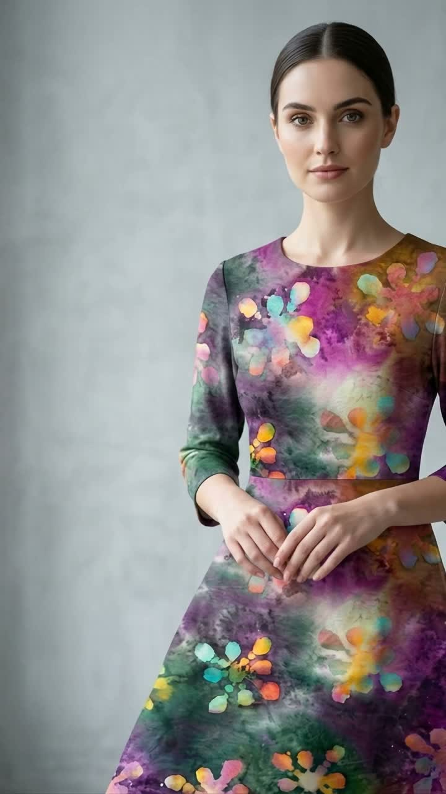

# L'AURA D'ART — 3D Cinematic Garment Experience

> A luxury haute couture fashion campaign website featuring a scroll-controlled 3D garment reveal sequence built from 174 high-resolution cinematic frames.



---

## 🌟 Overview

**L'AURA D'ART** is an interactive, high-fashion web experience designed to showcase an organic mulberry silk maxi dress adorned with hand-painted botanical watercolor artwork. 

Rather than relying on generic image galleries, the website reconstructs a 174-frame camera sequence into a **scroll-driven 3D animation**. As the user scrolls through the page, the viewport pins in place while the garment transforms seamlessly frame-by-frame.

---

## ✨ Key Features

- **174-Frame Scroll-Driven Motion Sequence**:
  - Smooth lerped interpolation (`requestAnimationFrame`) mapping scroll progress directly to frame indices.
  - Preserves source image aspect ratio (`720 × 1280` 9:16 portrait) across desktop, tablet, and mobile.
- **High-DPI HTML5 Canvas Rendering**:
  - Automatically scales for Retina displays (`window.devicePixelRatio`) with clean zero-stutter performance.
- **Asynchronous Batch Preloader**:
  - Preloads frames progressively in the background with a real-time progress indicator (`0%` $\rightarrow$ `100%`) before unveiling the experience.
- **Dynamic Glassmorphic Timeline Beats**:
  - Glassmorphic overlay cards (*01 / PORTRAIT*, *02 / FORM*, *03 / SILHOUETTE*, *04 / MOVEMENT*) appearing at key editorial moments in the sequence.
  - Interactive bottom timeline track with clickable markers to jump directly to key reveal beats.
- **Atmospheric Dual-Tone Aura**:
  - Dynamic violet and champagne gold backlights that illuminate the model in motion.
- **Savoir-Faire & Craftsmanship Inspection**:
  - Interactive tabs (*Botanical Dyeing*, *Silk Weave*, *45° Bias Architecture*) with 10X macro detail previews.
- **Atelier Lookbook Showcase Card**:
  - Numbered edition showcase (\$1,850 USD), size selection pills (XS–XL), lookbook thumbnail gallery, and slide-over Atelier Bag drawer.
- **Full Responsive Design**:
  - Tailored composition for mobile, tablet, and widescreen desktop displays.

---

## 🛠️ Technology Stack

- **Core Framework**: [React 18](https://react.dev/) + [TypeScript](https://www.typescriptlang.org/)
- **Build Tool**: [Vite 5](https://vitejs.dev/)
- **Rendering Engine**: HTML5 Canvas 2D (Context 2D)
- **Styling System**: Vanilla CSS with custom glassmorphic tokens & typography variables
- **Typography**: Google Fonts ([Cormorant Garamond](https://fonts.google.com/specimen/Cormorant+Garamond) serif & [Plus Jakarta Sans](https://fonts.google.com/specimen/Plus+Jakarta+Sans) sans-serif)
- **Icons**: [Lucide React](https://lucide.dev/)

---

## 🚀 Getting Started

### Prerequisites

Ensure you have [Node.js](https://nodejs.org/) (v18 or higher) installed.

### Installation

1. **Clone the repository**:
   ```bash
   git clone https://github.com/gitkkarthik/3d-website.git
   cd 3d-website
   ```

2. **Install dependencies**:
   ```bash
   npm install
   ```

3. **Start the development server**:
   ```bash
   npm run dev
   ```
   Open your browser at `http://localhost:3000/` to experience the website locally.

4. **Build for production**:
   ```bash
   npm run build
   ```

---

## 📁 Project Structure

```text
3d-website/
├── public/
│   └── frames/              # 174 frame images (ezgif-frame-001.jpg to ezgif-frame-174.jpg)
├── src/
│   ├── components/          # UI & Animation Components
│   │   ├── Preloader.tsx              # Asset loading screen with progress %
│   │   ├── Navbar.tsx                 # Floating top header with progress bar
│   │   ├── HeroIntro.tsx              # Section 01: Opening statement
│   │   ├── GarmentSequenceCanvas.tsx  # Section 02: Pinned sticky 174-frame sequence
│   │   ├── EditorialStory.tsx         # Section 03: Product philosophy & story
│   │   ├── Craftsmanship.tsx          # Section 04: Savoir-faire & macro zoom
│   │   ├── ProductShowcase.tsx        # Section 05: Atelier lookbook card & shop CTA
│   │   ├── ClosingEditorial.tsx       # Section 06: Finale & registry footer
│   │   └── AtelierDrawer.tsx          # Slide-over shopping bag drawer
│   ├── utils/
│   │   ├── FrameLoader.ts             # Preloader & high-DPI canvas drawer
│   │   └── Timeline.ts                # Scroll lerp math & timeline beats
│   ├── App.tsx                        # Main application orchestrator
│   ├── index.css                      # Luxury design system & styling
│   └── main.tsx                       # React root entrypoint
├── index.html
├── vite.config.ts
├── package.json
└── README.md
```

---

## 📜 License

This project is licensed under the MIT License. Developed for **L'AURA D'ART Haute Couture**.
